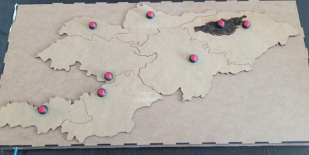

# Кенжегулов Нурболот Калысбекович

Студент, инженер и разработчик.
Стремлюсь применить знания в области телематики и смежных дисциплин для разработки инновационных технических решений и обеспечения стабильной работы информационно-технических систем.

---

## 
| Категория | Технологии |
| :--- | :--- |
| **Software** | Python, C++, JS |
| **Hardware** | Arduino, ESP32, Raspberry Pi, CNC-системы, PLC |
| **Environment** | ArduinoIDE, TIA Portal, Codesys, KiCad, Matlab, VC Code |
| **Design** | SolidWorks, Creality Print, Cura, LightBurn, CorelDraw |
| **Protocols** | OPC UA, I2C, TCP/IP, HTTP/REST |

---

##  Учебные проекты

### 1. Интерактивная тактильная карта Кыргызстана
*Создание обучающего пособия для людей с нарушениями зрения.*

---

## 📊 Активность

  

---
*Связаться со мной можно через по email.*
