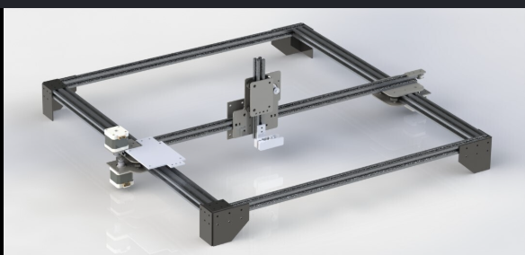

# Привет! Я Нурболот Кенжегулов 👋

Студент-телематик, инженер и разработчик. Увлекаюсь автоматизацией, проектированием механики и созданием умных систем.

## 🛠 Технологический стек
- **Backend/Software:** Python (FastAPI, SQLAlchemy), Scikit-learn, Pandas.
- **Embedded/Hardware:** Arduino (Mega, Nano), ESP32, CNC-системы.
- **CAD/Design:** SolidWorks, Creality Print.
- **Network/Telematics:** Понимание принципов GSM/UMTS/LTE (в процессе обучения).

## 🚀 Избранные проекты
*Здесь мы позже вставим ссылки на ваши основные проекты.*

## 📊 Моя активность

---
*Связаться со мной можно через LinkedIn или по email.*
